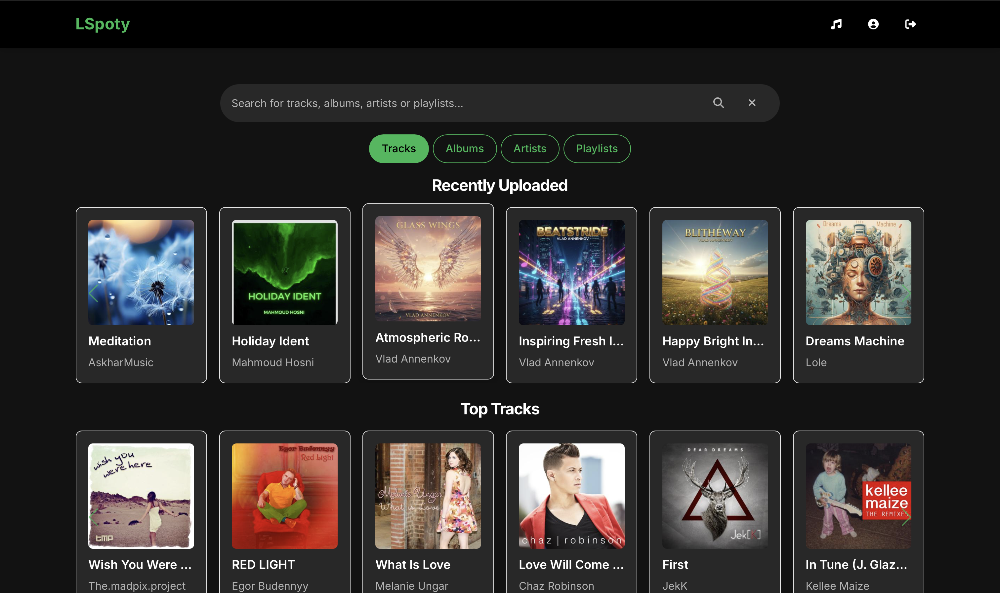
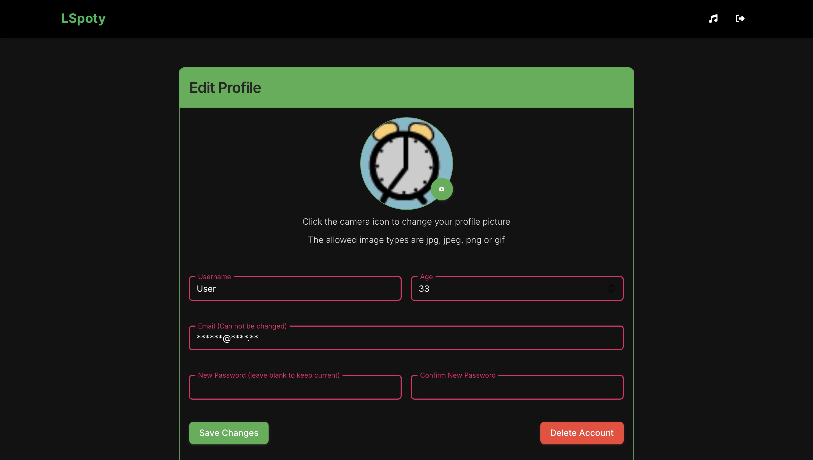
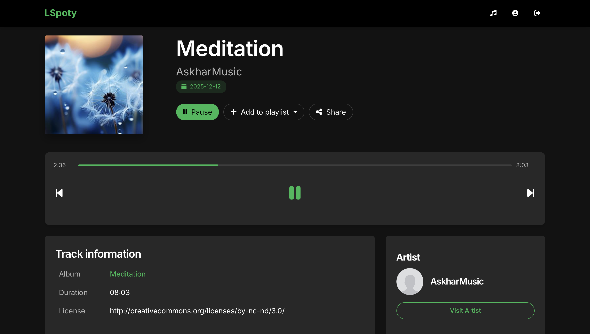

# 🎧 LSMusic
## Web Projects II - La Salle BCN

## 👥 Authors
- [Pol Monné](https://github.com/pomopa)
- [Roger Metaute](https://github.com/RogerMetaute) 
- [Joan Enric Peiró](https://github.com/J0hnny22)
  
---

## 🧠 Project Description
This project provides a complete web application, including both front end and back end, designed to offer users a free and accessible music platform. After registering and logging in, users can explore playlists, albums, artists, and many other interactive features. The application is developed using the CodeIgniter framework and is fully open for anyone to deploy by following the setup steps described below.

---

## 📑 Table of Contents

1. [How to Start the Project](#how-to-start-the-project)
2. [Endpoint Implementation](#endpoint-implementation)
3. [Route Aliases](#route-aliases)
4. [Project Translation](#project-translation)
5. [Security Validations](#security-validations)

---

## How to Start the Project

To start the project, it is necessary to configure the Docker and CodeIgniter environment files.  
The configuration used during development is included in the repository and is the same one used by all group members.  
Follow these steps to configure the project and the database:

1. Configure the Docker `.env` file  
2. Start Docker containers  
    ```bash
    docker compose up -d
    ```
3. Install Composer dependencies  
    ```bash
    docker compose exec app composer install
    ```
4. Configure the project `.env` file. You must place your own private API key inside.
   ```
   CI_ENVIRONMENT=production
   JAMENDO_API_KEY=your_api_key
   ```
5. Run migrations  
    ```bash
    docker compose exec app php spark migrate
    ```

---

## 📸 Demo Screenshots

Below are some preview images showcasing the main pages of the application.

### 🏠 Home Page


### 🎶 Main View Page


### 📁 Playlists Page


### ☕️ Personal Profile Page


### 🔎 Search Detail


### 🎤 Song Detail



---


## Endpoint Implementation

All required endpoints from the assignment were implemented, but the following ones were **not implemented exactly as instructed by the teaching staff**, due to inconsistencies in the specifications:

- `POST /artist/{id}`
- `POST /album/{id}`
- `POST /playlist/{id}`
- `POST /my-playlist/{id}`

It is also important to highlight that for the `PUT /my-playlist/{id}` endpoint, and following the professor’s instructions, the functionality was modified from what the assignment originally described.  
Although the assignment stated that this endpoint should create a new playlist, this was illogical because the endpoint `POST /create-playlist` already exists, and the PUT method is intended for updating resources, not creating them.  
Therefore, this endpoint has been implemented to **update an existing playlist**.

---

## Route Aliases

Aliases were created to improve readability and simplify route usage.  
Each route has a unique alias that identifies it throughout the system.  
Some examples include:

- `landing_view` → Alias for `/`
- `sign-up_success` → Alias for `/sign-up/success`
- ...

All aliases are documented in the route file.

---

## Project Translation

The project has been fully translated into **Catalan**, including:

- Frontend text
- Explanatory comments
- Error and validation messages
- JavaScript alerts

The system automatically applies this translation whenever the user's browser is set to Catalan.  
If not, the default language is English.

---

## Security Validations

Throughout the development of the project, we focused on creating a safe and robust application, protecting both the frontend and the backend against malicious attacks.  
Some implemented security measures include:

- **Input sanitization**: all inputs are validated on both frontend and backend.
- **Authentication control**: certain routes are restricted to registered users using filters.
- **Image validation**: uploaded files are checked for allowed types, matching mimetypes, and ensuring only one image is uploaded.
- **File verification**: any POST route not controlled by the image filter checks that users are not sending files to the server.
- **Image storage**: images are stored in the `/writable` directory and served through a controller for secure frontend access. A user can access only their own images after registering.
- **Folder structure**: inside `writable/uploads`, each user has a folder named after their ID with `/profile` and `/playlists` subfolders. This structure modularizes storage and prevents filename collisions when scaling.

These measures, among others, ensure a sufficiently secure environment for running the service.
