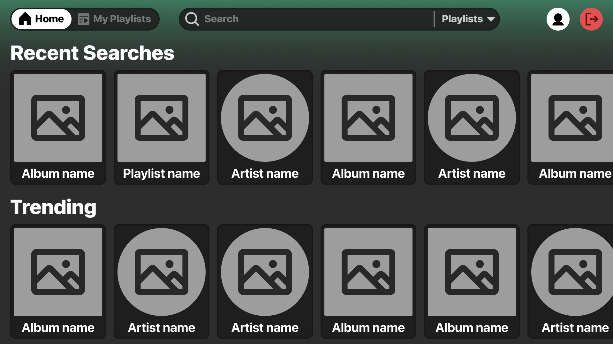
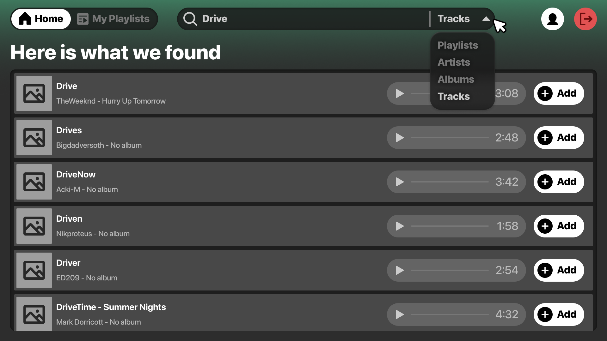
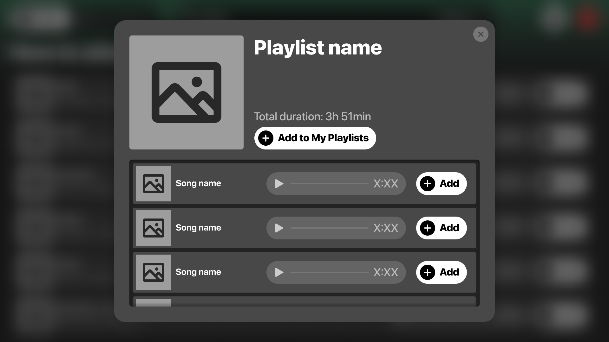
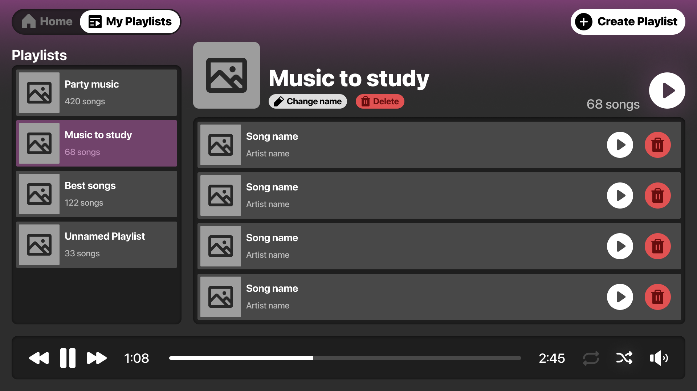

# LSpoty

LSpoty is your ultimate destination for discovering and enjoying music like never before! Whether you're a music enthusiast looking to explore new artists, create personalized playlists, or simply enjoy your favorite tracks, LSpoty has got you covered. From detailed artist profiles to curated playlists and album collections, LSpoty offers everything you need to elevate your music journey.

## Prerequisites

To set up and run this web app, you'll need the following:

1. Web server (Nginx)
2. PHP 8
3. MySQL
4. Composer
5. Git

For this project, please use the provided Docker `pwii-lspoty-environment` setup.

## Requirements

1. Use CodeIgniter as the underlying framework.
2. Use Composer to manage all the dependencies of your application. You must add at least one new dependency.
3. Use Guzzle to make requests to the API. 
4. Usage of CodeIgniter's Filters is required. 
5. Usage of CodeIgniter's template engine with almost a base template and inheritance is required. 
6. Implement CSS to add style to your application. Optionally, you may use a CSS framework. Keep the CSS organized and avoid using raw HTML without styling. Similarly, keep your JS organized and separated from the HTML templates. 
7. Use MySQL as the main database management system. 
8. Use the provided DB Migration files. Feel free to create new tables or modify the ones provided, but make sure to include the new migrations in the repository.
9. Effectively use Object-Oriented Programming principles, including Namespaces, Classes, and Interfaces. 
10. Use Git to collaborate with your teammates. 
11. Upload all the code to the private Git repository assigned to your team. 
12. Each team member must actively contribute to the project with at least 10 commits.
13. The web must be translated into 2 languages. You can choose the languages you want, but at least one of them must be English. The other language can be any other language you prefer.
14. The site must detect the user's language automatically and display the content in that language. If the language is not supported, it should default to English.
15. Use database migrations to create new tables, or alter any of the database tables that we provided.
16. Your environment must be configured as Production when you deliver the project. This means that you must set the environment variable `CI_ENVIRONMENT` to `production` in your `.env` file.

### Use of AI assistants and tools - Disclosure

You are allowed to use AI assistants to search for information and ask questions, but you shall not use AI to generate code. During project interviews, you will need to disclose any AI usage, and if there are concerns about your code's authenticity, you may be asked to provide the source or inspiration for specific code sections.

That being said, we strongly encourage you to try and understand the concepts you're applying and figure out the reason behind any issues you encounter before blindly trying to get a LLM to solve a problem for you. In case of doubt, we recommend consulting a human instead of a machine.

## Resources

### MySQL

Use the provided DB Migration files to create the tables in the MySQL database. Feel free to create new tables or modify the ones provided, but make sure include the new migrations in the repository.

## Sections

The functionalities you must implement in this project can be divided into the following sections:

1. Landing Page
2. User Registration and Login
3. Homepage
4. User Profile
5. Artist Details 
6. Album Details 
7. Playlist Details 
8. My Playlists 
9. Create Playlist 
10. My Playlists Management

### Landing Page

| Endpoints | Method |
|-----------| ------ |
| /         | GET    |

The Landing Page will display a welcome message along with a button to invite users to either Sign In or Register. It must show the amazing features of the application. The page should be visually appealing and responsive, ensuring a great user experience across all devices.

This page is only accessible to unregistered users, meaning that logged users should be redirected to `/home`.

### Sign-up

This section describes the process of signing up a new user into the system.

| Endpoints  | Method |
| ---------- | ------ |
| /sign-up   | GET    |
| /sign-up   | POST   |

When a user accesses the `/sign-up` endpoint, you need to display the registration form. The information from the form must be sent to the same endpoint using a **POST** method. The registration form should include the following inputs:

- Username - optional. If users do not provide a username, the system will use the email address as the username (without the domain).
- Profile picture - optional. If users do not provide a profile picture, the system will use a default image.
- Email - required.
- Password - required.
- Repeat password - required.

When a **POST** request is sent to the `/sign-up` endpoint, you must validate the information received from the form and sign up the user only if all the validations have passed. The requirements for each field are as follows:

- Email: It must be a valid email address (@students.salle.url.edu, @ext.salle.url.edu or @salle.url.edu). The email must be unique among all users of the application.
- Password: It must not be empty and must contain at least 8 characters, at least one number and both upper and lower case letters.
- Repeat password: It must be the same as the password field.

If there are any errors, you need to display the sign-up form again. All the information entered by the user should be kept and shown in the form (except for password fields) together with all the errors below the corresponding inputs.

Here are the error messages that you need to show respectively:

- Only emails from the domain @students.salle.url.edu, @ext.salle.url.edu or @salle.url.edu are accepted.
- The email address is not valid.
- The email address is already registered.
- The password must contain at least 8 characters.
- The password must contain both upper and lower case letters and numbers.
- Passwords do not match.

Once the user's account is created, the system will allow the user to sign in with the newly created credentials.

### Sign-in

This section describes the process of logging into the system.

| Endpoints  | Method |
| ---------- | ------ |
| /sign-in   | GET    |
| /sign-in   | POST   |

When a user accesses the `/sign-in` endpoint, you need to display the sign-in form. The information from the form must be sent to the same endpoint using a **POST** method. The sign-in form should include the following inputs:

- Email - required.
- Password - required.

When the application receives a **POST** request to the `/sign-in` endpoint, it must validate the information received from the form and attempt to log in the user. The validations for the inputs should be the same as in the registration.

If there are any errors or if the user does not exist, you need to display the form again with all the information provided by the user and display the corresponding error.

Here are the error messages that you need to show respectively:

- The email address is not valid.
- Your email and/or password are incorrect.

After logging in, the user will be redirected to the homepage.

### Homepage

| Endpoints | Method |
|-----------| ------ |
| /home     | GET    |

Users must be logged in to access this endpoint. There must be a header with buttons to access My Playlists page, the user profile, and you can also add a button to log out. There also must be a search bar that users will use to search either **Tracks**, **Albums**, **Artists** or **Playlists**. You are free to choose the content of the homepage, you can get inspiration from the example below of how it could look like:



When the user introduces a text in the search bar and clicks on the search button, the system will  show the results of the search from the [Jamendo API](https://developer.jamendo.com/v3.0/docs). As explained earlier, it is suggested that search is filtered by **Tracks**, **Albums**, **Artists** or **Playlists**. The search results should be displayed in a list format, similar to the example below:



To access the Jamendo API, you need to create an account and obtain an API key in their [developer portal](https://devportal.jamendo.com/).

### User Profile

| Endpoints | Method |
|-----------| ------ |
| /profile  | GET    |
| /profile  | POST   |

This endpoint should be accessible from `/home` and must allow users to change their password, profile picture, and username (the email should be displayed but cannot be changed). Users should also be able to enter their age as a numeric value (for example, `24`). Additionally, there should be a delete account button. If the account is deleted, the user will be logged out, redirected to the landing page, and removed from the database. Access to this endpoint is restricted to logged-in users.

### Artist Details

| Endpoints    | Method |
|--------------| ------ |
| /artist/{id} | GET    |
| /artist/{id} | POST   |

This endpoint should be accessible when a user clicks on an artist either if it was searched or found in the main content of `/home`. It should also be accessed when pressing their name on a track or album author. Only logged users can access it. The page should contain the following:

- Artist name
- Artist profile picture
- Join date
- A list with the album the artist has released

### Album Details

| Endpoints   | Method |
|-------------| ------ |
| /album/{id} | GET    |
| /album/{id} | POST   |

This endpoint should be accessible when a user clicks on an album either if it was searched or found in the main content of `/home`. Only logged users can access it. The page should contain the following:

- Album name
- Album cover
- Artist (if pressed it will redirect to the artist page)
- Release date
- A list of the tracks from the album
- Total duration of the tracks of the album

Here is an example of how it could look like:


### Playlist Details

| Endpoints      | Method |
|----------------| ------ |
| /playlist/{id} | GET    |
| /playlist/{id} | POST   |

This endpoint should be accessible when a user clicks on a playlist either if it was searched or found in the main content of `/home`. Only logged users can access it. The page should contain the following, very similar to the Album Details layout:

- Playlist name
- Playlist cover
- A list of the tracks from the playlist
- Total duration of the tracks of the playlist
- A button to save the playlist in "My Playlists", which will be explained in the next section.

Here is an example of how it could look like:



### My Playlists

| Endpoints          | Method |
|--------------------|--------|
| /my-playlists      | GET    |
| /my-playlists/{id} | GET    |
| /my-playlists/{id} | POST   |

When a user accesses this endpoint from /home, they are presented with a dashboard where all of their created playlists are displayed. Here's a refined explanation of the functionality:

- Playlist Overview: Users will see a list of all playlists they have created. For each playlist, the cover image, the number of tracks, and a dedicated Play button are visible.
- Detailed Playlist View: When a user selects a specific playlist (indicated in the URL as `/my-playlists/{id}`), the page updates to show the tracks contained in that playlist. This detailed view includes options to rename or delete the playlist.
- Creating New Playlists: A clearly labeled button allows users to create a new playlist, redirecting them to the /create-playlist endpoint.
- Navigation: A button is available for users to easily return to the homepage.
- Integrated Music Player: The music player is a central feature of this page. When a playlist is selected, clicking the Play button starts playing the tracks in sequence. The player automatically moves to the next track upon finishing the current one. Additionally, the player includes the following controls:
  - Play/Pause Button: Start or pause playback.
  - Progress Bar: Visual feedback on the current track’s progress.
  - Repeat Button: Option to loop the entire playlist. 
  - Optional Controls: Users may also have the option to shuffle the tracks and adjust the volume.

This setup ensures that users can seamlessly view, manage, and play their playlists while enjoying full control over their listening experience. Here is an example of how the page could look like:



> **IMPORTANT:** All playlists found in My Playlists must be stored in the database. Use the provided DB Migration files.

### Create Playlist

| Endpoints        | Method |
|------------------| ------ |
| /create-playlist | GET    |
| /create-playlist | POST   |

This endpoint should be accessed from `/my-playlists` and only available to logged users. It must allow the user to create a new playlist. The form should include the following inputs:

- Name - required.
- Cover - optional. If the user does not provide a cover, the system will use a default image.

When the application receives a **POST** request to the `/create-playlist` endpoint, it must validate the information received from the form.

### My Playlists Management

| Endpoints                     | Method |
|-------------------------------|--------|
| /my-playlists/{id}            | PUT    |
| /my-playlists/{id}            | DELETE |
| /my-playlists/{id}/track/{id} | PUT    |
| /my-playlists/{id}/track/{id} | DELETE |

> **IMPORTANT:** Notice that, since users can update their playlists and add/remove tracks, the corresponding endpoints don't use the POST method, but rather PUT.

These endpoints will be used to add or remove playlists found in My Playlists as well as to add or remove tracks from them. This means that in `/create-playlists`, once the name and cover have been set, a **PUT** method will be used to `/my-playlists/{id}` to create the playlist. Deleted playlists in `/my-playlists` will use the **DELETE** method.

All tracks displayed throughout the webpage must have an **add button** to add them to a playlist they have. This will let the user choose which of their playlists they want to add the track to and then use a **PUT** method to `/my-playlists/{id}/track/{id}` to add the track to the playlist. Users will be able to remove track in `/my-playlists/{id}`, using the **DELETE** method.

Of course, only logged users will be able to access these endpoints.

### Considerations

> **IMPORTANT:** Although tracks do not have their own endpoint and are rather shown throughout various pages in this project, you must create a class for them. This class should be used to create the track objects that will be displayed. It must have the following properties:
> 
> - ID
> - Name
> - Cover
> - Artist name (which will be displayed)
> - Artist ID (which will be used to access the artist's page)
> - Album name (which will be displayed)
> - Album ID (which will be used to access the album's page)
> - Duration
> - Player URL
> 
> The **Player URL** is very important property since it will be used to play the tracks in My Playlists. This url must be used in the player, and you can use the **audio HTML tag** and setting the **Player URL** of the track as the source to run it in the website. An example would be the following:
> ```html
> <audio>
>  <source src="https://prod-1.storage.jamendo.com/?trackid=12345" type="audio/mpeg">
> </audio>
> ```

There is also needed to be taken into account the following considerations:

1. Only the playlists found in My Playlists should be stored in the database. Any other playlist that is not added there, along with albums and artists, must be called through the API. Only the tracks found in the user's playlists must be stored in the database in their corresponding playlist.
2. The endpoints described in the previous sections MUST be used exactly as is. You cannot use **/register** or **/login**.
2. You can use downloaded templates to create the views or create them from scratch.

## Submission

You must submit this exercise in two different ways:

- **Git:** You will use Git and annotated tags to release new versions of your application. Tags should be pushed to the Gitlab repository to make them accessible to your team and instructors. Use **tag** `v1.0.0` for the final version.

- **eStudy:** For academic reasons, we also require you to upload a zipped copy of the final repository version on eStudy.

Make sure that everything needed to properly run your code is present in the repository (including the DB Migration files), while avoiding committing any unnecessary files (such as the contents of the vendor folder or user uploads). In case you commit unnecessary files, know that they will stay in the repository's history, making your `.git` directory larger.

You can only submit this project in the ordinary call. The deadline is May 18th.

> **IMPORTANT:** Make sure to include a `INSTRUCTIONS.md` file with any information you deem necessary for us to understand how to use your application. This is particularly important when it comes to functionalities where you have creative control or multiple implementation options are proposed, as we won't know what choices you made during the development process.

## Evaluation

1. To evaluate the project, we will use the release `v1.0.0` of your repository.
2. In May, all the teams that have delivered the final release on time will be interviewed by the teachers.
3. In this interview, we will validate that each team member has actively contributed to the project as expected.
4. Check the syllabus of the subject for further information.

### Evaluation Criteria - `v1.0.0`

To grade the release `v1.0.0`, the distribution of points is as follows:

- Landing Page (Including semantic HTML, CSS of the whole project): 0.5p
- User Registration and Login: 1p
- Homepage: 1.5p
- User Profile: 1p
- Artist Details: 1p
- Playlist and Album Details: 1.5p
- My Playlists: 1.5p
- Create Playlist: 0.5p
- My Playlists Management: 1.5p
- Other criteria (clean code quality, clean design, etc.): -1.5p